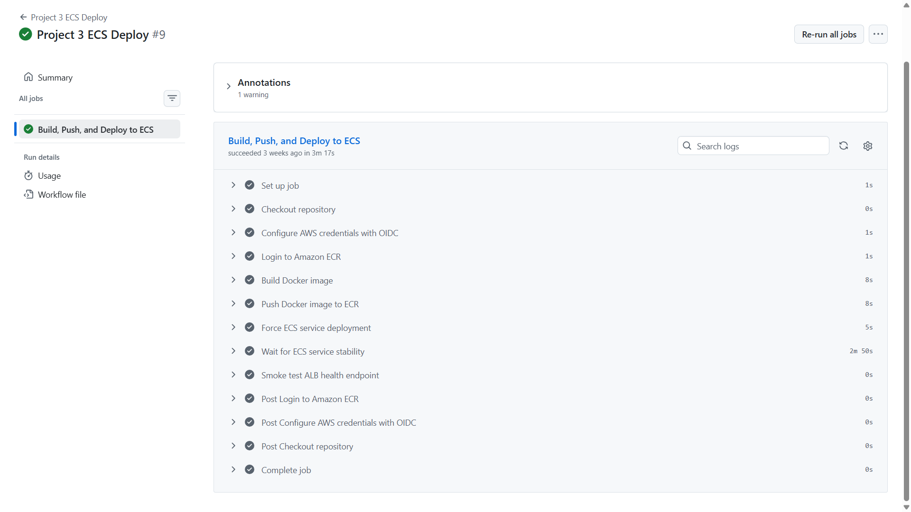
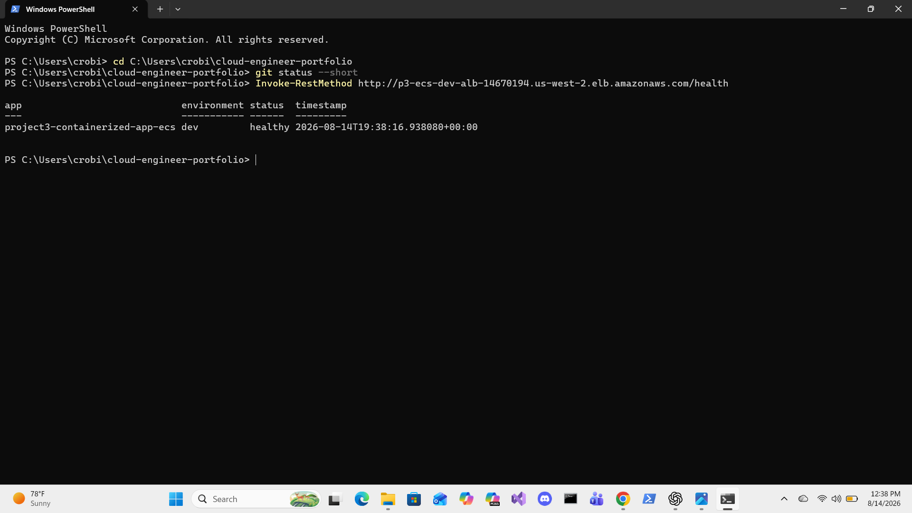
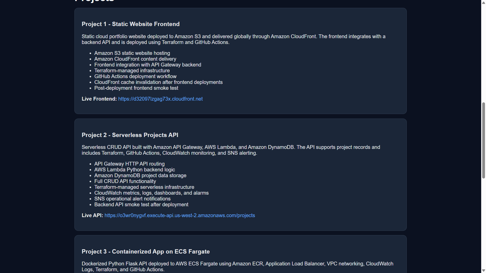

# Cloud Engineer Portfolio

## Overview

This portfolio demonstrates practical cloud engineering skills using AWS, Terraform, GitHub Actions, serverless architecture, and containerized application deployment.

The portfolio includes a static frontend website hosted on Amazon S3 and delivered through Amazon CloudFront, a serverless backend API built with API Gateway, AWS Lambda, and DynamoDB, and a containerized Flask application deployed to Amazon ECS Fargate behind an Application Load Balancer.

The project also includes infrastructure as code, CI/CD automation, remote Terraform state, AWS OIDC authentication, monitoring, alerting, deployment validation, CloudFront cache invalidation, Docker image deployment, ECS service deployment, and technical documentation.

## Portfolio Projects

| Project | Description | README |
|---|---|---|
| Project 1 - Static Website Frontend | Static frontend hosted on S3 and delivered through CloudFront | `project1-static-website/README.md` |
| Project 2 - Serverless Projects API | Serverless CRUD API using API Gateway, Lambda, and DynamoDB | `project2-serverless-api/README.md` |
| Project 3 - Containerized App on ECS Fargate | Dockerized Flask API deployed to ECS Fargate behind an Application Load Balancer | `project3-containerized-app-ecs/README.md` |

## Architecture Summary

The portfolio architecture includes:

* Amazon S3 for static website hosting
* Amazon CloudFront for frontend content delivery
* Amazon API Gateway for HTTP API routing
* AWS Lambda for serverless backend logic
* Amazon DynamoDB for project data storage
* Amazon ECR for container image storage
* Amazon ECS Fargate for serverless container hosting
* Application Load Balancer for public container traffic
* VPC networking for ECS and ALB resources
* Amazon CloudWatch for metrics, logs, dashboards, and alarms
* Amazon SNS for operational alert notifications
* Terraform for infrastructure provisioning
* GitHub Actions for CI/CD automation
* AWS OIDC for secure GitHub Actions authentication
* S3 remote backend for Terraform state storage
* Docker and Gunicorn for containerized Flask deployment

## Architecture Diagram

```mermaid
flowchart LR
    User[User Browser] --> CF[Amazon CloudFront]
    CF --> S3[Amazon S3 Static Website]

    S3 --> APIGW[Amazon API Gateway HTTP API]
    APIGW --> Lambda[AWS Lambda Python API]
    Lambda --> DynamoDB[Amazon DynamoDB Projects Table]

    User --> ALB[Application Load Balancer]
    ALB --> ECS[Amazon ECS Fargate Service]
    ECS --> Flask[Flask Container]
    Flask --> ECR[Amazon ECR Container Image]

    GitHub[GitHub Repository] --> Actions[GitHub Actions CI/CD]
    Actions --> OIDC[AWS OIDC Authentication]
    OIDC --> Terraform[Terraform Apply]
    Terraform --> AWS[AWS Infrastructure]

    Actions --> Docker[Docker Build]
    Docker --> ECR
    Actions --> ECSDeploy[ECS Service Deployment]
    ECSDeploy --> ECS

    Lambda --> CloudWatch[Amazon CloudWatch]
    APIGW --> CloudWatch
    ECS --> CloudWatch
    CloudWatch --> SNS[Amazon SNS Alerts]

This diagram shows the frontend delivery path, backend API path, containerized application path, infrastructure deployment path, and monitoring path for the portfolio.

Live Links

Frontend CloudFront URL:

https://d32097lzgag73x.cloudfront.net

Frontend S3 website endpoint:

http://chaliss-portfolio-site-127214156202.s3-website-us-west-2.amazonaws.com

Backend API endpoint:

https://o3wr0nygvf.execute-api.us-west-2.amazonaws.com/projects

Project 3 ECS Fargate Application URL:

http://p3-ecs-dev-alb-14670194.us-west-2.elb.amazonaws.com

Project 3 ECS Health Check:

http://p3-ecs-dev-alb-14670194.us-west-2.elb.amazonaws.com/health

Project 3 Projects API:

http://p3-ecs-dev-alb-14670194.us-west-2.elb.amazonaws.com/api/projects

Project Screenshots

### Project 3 ECS Deployment



### Project 3 ECS Health Check



### Updated Live Portfolio Projects



Project 1 Live Frontend Website

GitHub Actions Deployment

CloudWatch Monitoring Dashboard

Core Features
Static website deployed on AWS
Serverless backend API
Containerized Flask API deployed on ECS Fargate
Full CRUD functionality
Frontend-to-backend API integration
Docker image build and ECR deployment
Application Load Balancer routing for ECS
ECS Fargate service deployment
Terraform-managed infrastructure
Remote Terraform state stored in S3
GitHub Actions CI/CD workflows
Manual Terraform apply workflow for controlled deployments
AWS OIDC authentication for GitHub Actions
Least-privilege IAM deployment access
CloudWatch monitoring and alarms
CloudWatch Logs for Lambda and ECS workloads
SNS alert notifications
CloudFront cache invalidation after frontend deployments
Frontend, backend, and ECS post-deployment smoke tests
CI/CD and Deployment

This portfolio uses GitHub Actions to validate, build, and deploy infrastructure and applications.

The workflow includes:

Terraform format checks
Terraform validation
Terraform plan on push and pull request
Manual Terraform apply through GitHub Actions
Separate deployment paths for frontend, backend, and containerized workloads
AWS authentication through GitHub Actions OIDC
CloudFront cache invalidation after frontend deployment
Docker image build and push to Amazon ECR
ECS Fargate service deployment through GitHub Actions
ECS service stability wait after deployment
Frontend smoke test after Project 1 deployment
Backend API smoke test after Project 2 deployment
ALB health check smoke test after Project 3 ECS deployment
Deployment Validation

The portfolio includes post-deployment smoke tests to confirm that deployed services are reachable after infrastructure or application changes.

Validation checks include:

Frontend smoke test against the live CloudFront website
Backend smoke test against the live API Gateway endpoint
ECS smoke test against the live Application Load Balancer health endpoint
CloudFront cache invalidation after frontend deployments
Manual deployment workflow for controlled Terraform applies
Separate validation paths for frontend, backend, and ECS projects

These checks demonstrate that the deployment pipeline does more than provision infrastructure. It also verifies that the deployed application endpoints are available after changes are released.

Operations and Monitoring

This portfolio includes operational visibility and deployment improvements to make the infrastructure more production-like.

Operations features include:

CloudWatch dashboard for API and Lambda visibility
Lambda error alarm
Lambda throttle alarm
Lambda duration alarm
API Gateway 5XX error alarm
CloudWatch log group for ECS container logs
ECS container logs using the awslogs log driver
SNS alert topic for operational notifications
GitHub Actions deployment workflow with AWS OIDC authentication
Remote Terraform state stored in S3
CloudFront cache invalidation after frontend deployments

These additions show that the project is not only deployed, but also monitored, documented, and maintained using cloud engineering best practices.

Skills Demonstrated

This portfolio demonstrates hands-on experience with:

AWS cloud infrastructure
Static website hosting with S3 and CloudFront
Serverless application architecture
API Gateway and Lambda integration
DynamoDB data persistence
Containerized application deployment
Docker image creation
Amazon ECR image storage
ECS Fargate container orchestration
Application Load Balancer routing
VPC networking and security groups
Infrastructure as Code with Terraform
CI/CD automation with GitHub Actions
GitHub Actions OIDC authentication
IAM and least-privilege access
CloudWatch monitoring, logging, and alerting
SNS notification workflows
Post-deployment validation
Git and GitHub version control
Technical documentation
Portfolio Value

This portfolio shows the ability to design, deploy, monitor, and maintain cloud-based applications using modern cloud engineering practices.

It demonstrates more than basic deployment. It includes infrastructure automation, secure CI/CD authentication, operational monitoring, alerting, cache management, container orchestration, smoke testing, and documentation.

