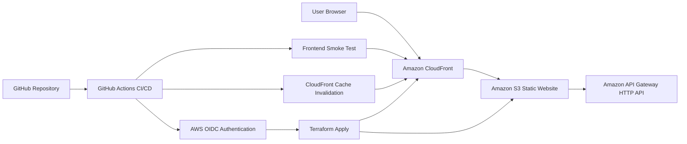

# Project 1 - Static Website Frontend

## Overview

This project is the frontend application for the Cloud Engineer Portfolio. It is a static website hosted on Amazon S3 and delivered globally through Amazon CloudFront.

The frontend connects to the serverless backend API from Project 2 and allows users to create, view, update, and delete portfolio project records stored in DynamoDB.

## Architecture

The frontend architecture uses the following AWS services:

* Amazon S3 for static website hosting
* Amazon CloudFront for content delivery
* API Gateway for backend API access
* AWS Lambda for backend business logic
* DynamoDB for project data storage
* Terraform for infrastructure provisioning
* GitHub Actions for CI/CD automation
* AWS OIDC for secure GitHub Actions authentication

## Architecture Diagram

This diagram shows how the frontend is delivered through CloudFront and S3, how Terraform deploys the frontend infrastructure, and how GitHub Actions validates the site after deployment.

## Live Website

CloudFront URL:

https://d32097lzgag73x.cloudfront.net

S3 Website Endpoint:

http://chaliss-portfolio-site-127214156202.s3-website-us-west-2.amazonaws.com

## Frontend Functionality

The website supports full CRUD interaction with the serverless backend API.

| Feature         | Description                                                          |
| --------------- | -------------------------------------------------------------------- |
| Create Project  | Submits a new project to the backend API                             |
| Read Projects   | Loads existing projects from DynamoDB through API Gateway            |
| Update Project  | Edits an existing project using the frontend form                    |
| Delete Project  | Removes an existing project by ID                                    |
| API Integration | Uses JavaScript fetch requests to call the live API Gateway endpoint |

## API Integration

The frontend connects to this backend API endpoint:

https://o3wr0nygvf.execute-api.us-west-2.amazonaws.com/projects

Supported API actions from the frontend:

| Method | Route            | Purpose                    |
| ------ | ---------------- | -------------------------- |
| GET    | `/projects`      | Load all projects          |
| POST   | `/projects`      | Create a new project       |
| PUT    | `/projects/{id}` | Update an existing project |
| DELETE | `/projects/{id}` | Delete an existing project |

## Terraform Resources

This project provisions resources such as:

* `aws_s3_bucket`
* `aws_s3_bucket_website_configuration`
* `aws_s3_bucket_public_access_block`
* `aws_s3_bucket_policy`
* `aws_s3_object`
* `aws_cloudfront_distribution`

## CI/CD

This project is deployed through GitHub Actions using Terraform.

The workflow supports:

* Terraform format checks
* Terraform validation
* Terraform plan on push and pull request
* Manual Terraform apply through GitHub Actions
* AWS authentication through GitHub Actions OIDC
* Remote Terraform state stored in S3

## Deployment Validation

This frontend project includes post-deployment validation through GitHub Actions.

Validation features include:

* Terraform apply through a manual GitHub Actions workflow
* CloudFront cache invalidation after frontend deployments
* Frontend smoke test against the live CloudFront URL
* Remote Terraform state stored in S3
* AWS authentication through GitHub Actions OIDC

These checks help confirm that the frontend deployment completed successfully and that the live CloudFront site is reachable after release.

## Key Features

* Static website hosted on Amazon S3
* CloudFront distribution for faster global delivery
* JavaScript frontend connected to a live serverless API
* Full frontend CRUD support
* Terraform-managed infrastructure
* GitHub Actions CI/CD workflow
* CloudFront cache invalidation after deployment
* Post-deployment smoke test for frontend availability
* Clean separation between frontend and backend projects

## Portfolio Value

This project demonstrates practical cloud engineering skills including static website hosting, CDN configuration, infrastructure as code, CI/CD automation, API integration, and deployment validation.

It shows how a frontend application can be deployed on AWS and connected to a serverless backend using production-style deployment practices.
