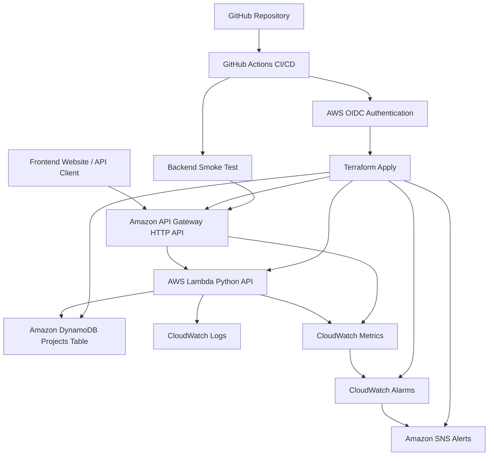
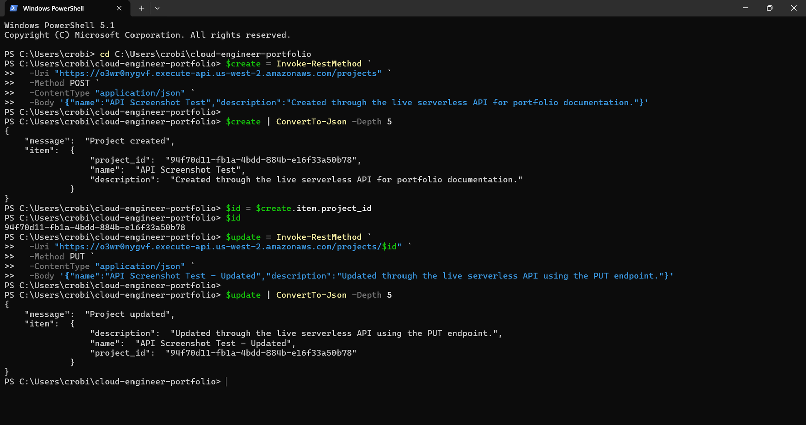
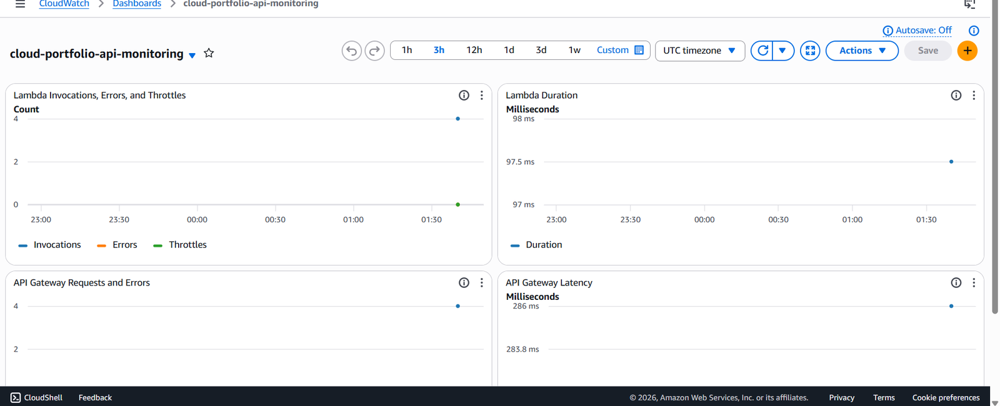

# Project 2 - Serverless Projects API

## Overview

This project is the backend API for the Cloud Engineer Portfolio. It uses a serverless AWS architecture to manage portfolio project records through a REST-style API.

The API is built with Amazon API Gateway, AWS Lambda, and Amazon DynamoDB. It supports full CRUD functionality and is deployed with Terraform through GitHub Actions.

## Architecture

The backend architecture uses the following AWS services:

* Amazon API Gateway for HTTP API routing
* AWS Lambda for backend business logic
* Amazon DynamoDB for project data storage
* Amazon CloudWatch for logs, metrics, dashboards, and alarms
* Amazon SNS for alert notifications
* Terraform for infrastructure provisioning
* GitHub Actions for CI/CD automation
* AWS OIDC for secure GitHub Actions authentication

## Architecture Diagram

This diagram shows how the backend API receives requests, processes them with Lambda, stores data in DynamoDB, sends logs and metrics to CloudWatch, triggers SNS alerts, and is deployed through Terraform using GitHub Actions.

## Live API

API Gateway endpoint:

https://o3wr0nygvf.execute-api.us-west-2.amazonaws.com/projects

## Available Routes

| Method | Route            | Purpose                          |
| ------ | ---------------- | -------------------------------- |
| GET    | `/projects`      | Return all portfolio projects    |
| POST   | `/projects`      | Create a new portfolio project   |
| PUT    | `/projects/{id}` | Update an existing project by ID |
| DELETE | `/projects/{id}` | Delete a project by ID           |

## Screenshots

### API CRUD Result

### CloudWatch Monitoring Dashboard

## Terraform Resources

This project provisions resources such as:

* `aws_dynamodb_table`
* `aws_iam_role`
* `aws_iam_role_policy`
* `aws_iam_role_policy_attachment`
* `aws_lambda_function`
* `aws_lambda_permission`
* `aws_apigatewayv2_api`
* `aws_apigatewayv2_integration`
* `aws_apigatewayv2_route`
* `aws_apigatewayv2_stage`
* `aws_cloudwatch_metric_alarm`
* `aws_cloudwatch_dashboard`
* `aws_sns_topic`

## CI/CD

This project is deployed through GitHub Actions using Terraform.

The workflow supports:

* Terraform format checks
* Terraform validation
* Terraform plan on push and pull request
* Manual Terraform apply through GitHub Actions
* Backend smoke test after deployment
* AWS authentication through GitHub Actions OIDC
* Remote Terraform state stored in S3

## Deployment Validation

This backend project includes post-deployment validation through GitHub Actions.

Validation features include:

* Terraform apply through a manual GitHub Actions workflow
* Backend smoke test against the live API Gateway endpoint
* Remote Terraform state stored in S3
* AWS authentication through GitHub Actions OIDC
* Separate deployment path from the frontend project

These checks help confirm that the backend deployment completed successfully and that the live API endpoint is reachable after release.

## Operations and Monitoring

This serverless API includes monitoring and alerting resources to improve operational visibility.

Monitoring features include:

* CloudWatch dashboard for Lambda and API Gateway metrics
* Lambda error alarm
* Lambda throttle alarm
* Lambda duration alarm
* API Gateway 5XX error alarm
* SNS alert topic for operational notifications
* Terraform-managed monitoring resources
* GitHub Actions deployment workflow with AWS OIDC authentication

These features help demonstrate production-style cloud operations, including observability, alerting, and controlled infrastructure deployments.

## Key Features

* Serverless API architecture
* Python-based Lambda handler
* DynamoDB persistence layer
* Full CRUD support
* API Gateway HTTP API routing
* Terraform-managed infrastructure
* GitHub Actions CI/CD workflow
* Backend smoke test after deployment
* CloudWatch monitoring and alarms
* SNS alerting for operational visibility
* Clean separation between frontend and backend projects

## Portfolio Value

This project demonstrates practical cloud engineering skills including serverless API development, infrastructure as code, CI/CD automation, cloud monitoring, alerting, and deployment validation.

It shows how a backend API can be deployed on AWS using production-style practices such as remote Terraform state, least-privilege deployment access, observability, and automated post-deployment testing.
